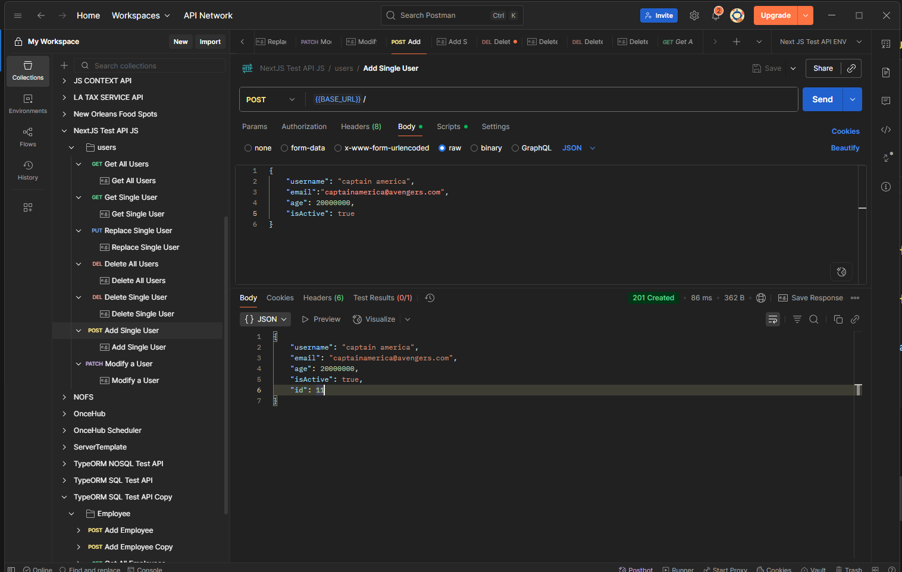
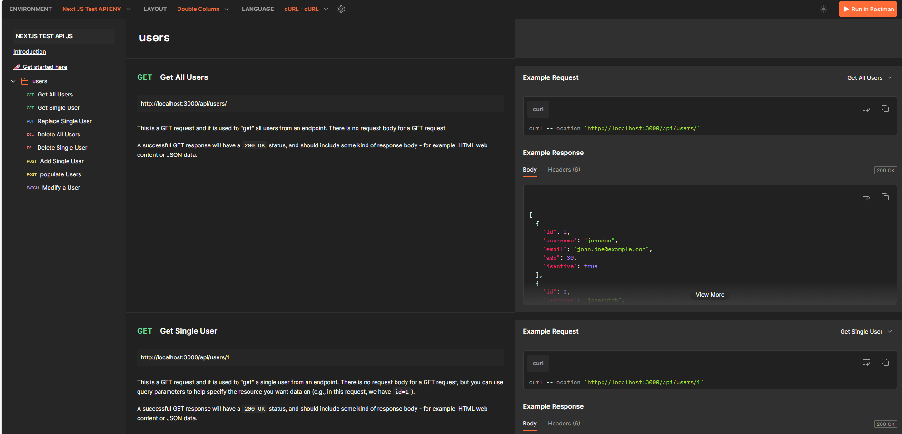
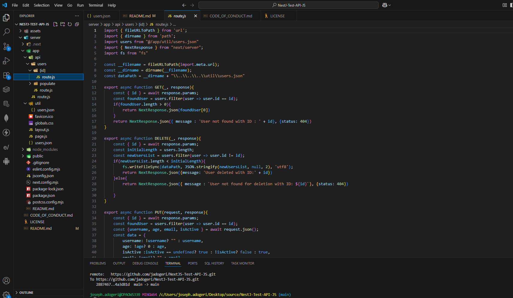
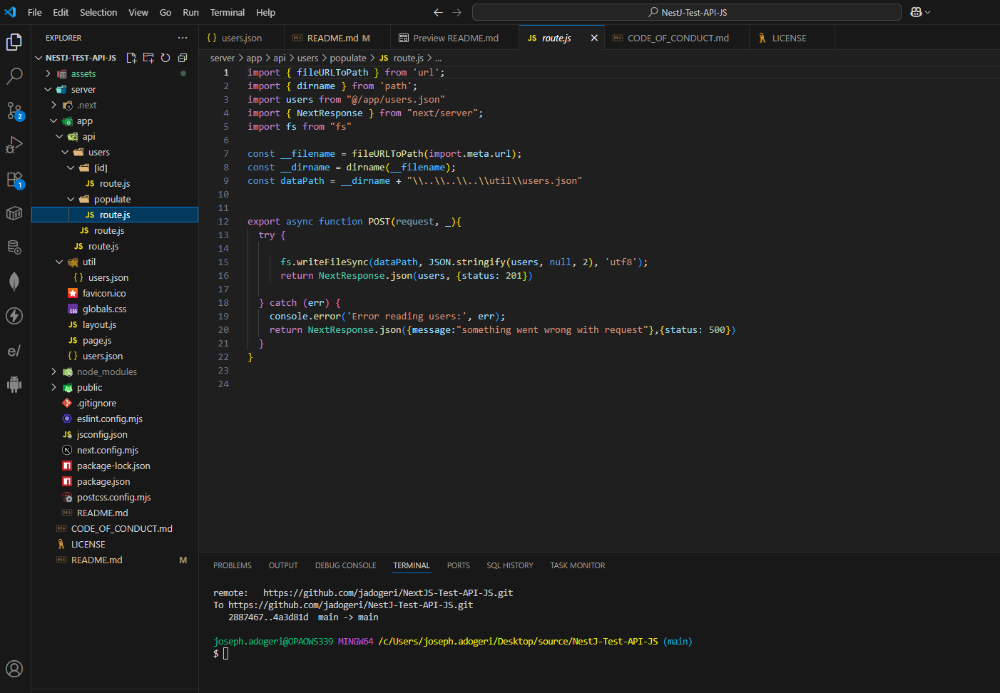

# **NEXTJS TEST API JS**

**Version:** 1.0.1
**Date:** August 14, 2025

---

## Description

This is a nextjs application (javascript) for testing CRUD in frontend or backend applications.

## Authors

[@jadogeri](https://www.github.com/jadogeri)

## Repository

 [https://github.com/jadogeri/NextJS-Test-API-JS.git](https://github.com/jadogeri/NextJS-Test-API-JS.git)


## Screenshots

|  |  |
| -------------------------------------------- | -------------------------------------------- |
|  |  |
|                                              |                                              |

## Table of Contents

<ul>
      <li><a href="#1-introduction">1. Introduction</a>
        <ul>
          <li><a href="#11-purpose">1.1 Purpose</a> </li>
          <li><a href="#12-scope">1.2 Scope</a> </li>
          <li><a href="#13-intended-audience">1.3 Intended Audience</a> </li>
        </ul>
      </li>
    </ul>
    <ul>
      <li><a href="#2-technology-stack">2. Technology Stack</a>
      </li>
      <li><a href="#2-technology-stack">https://documenter.getpostman.com/view/40822092/2sB3BHjTYz</a>
      </li>
    </ul>
    <ul>
      <li><a href="#3-usage">3. Usage</a> </li>
        <ul>
          <li><a href="#30-install-dependency">3.0 Install Dependency</a> </li>
          <li><a href="#31-initialization">3.1 Initialization</a> </li>
            <ul>
                <li><a href="#310-api-manager-object">3.1.0 API Manager Object</a> </li>
                <li><a href="#311-config-object">3.1.1 Config Object</a> </li>
            </ul>
          <li><a href="#32-class-and-methods">3.2 Class and Methods</a> </li>
           <ul>
            <li><a href="#321-apimanager-class">3.2.1 API Manager Class</a> </li>
            </ul>
          <li><a href="#33-code-snippet">3.3 Code Snippet</a> </li>
        </ul>
    </ul> 
    <ul>
        <li><a href="#4-tests">4. Tests</a> </li>
        <ul>
            <li><a href="#51-test-using-jest">4.1 Test Using Jest</a> </li>
            <li><a href="#52-test-using-npm-link">4.2 Test Using NPM Link</a> </li>
            <li><a href="#53-test-using-npm-pack">4.3 Test Using NPM Pack</a> </li>
        </ul>
    </ul> 
    <ul>  
        <li><a href="#5-license">5. License</a>
        </li>
    </ul> 
    <ul> 
        <li><a href="#6-references">6. References</a>
        </li>
    <ul>

## 1. Introduction

### 1.1 Purpose

This document outlines the package architecture, components, and design considerations for Fetching Data from an API. The goal is to create an abstraction to Fetch API implementation and perform CRUD operations.

### 1.2 Scope

This package will allow users to:

- Performs GET, POST, PUT, PATCH and DELETE requests.
- Allows headers and baseUrl to be set after initialization.
- Abstracts Fetch API implementation..

### 1.3 Intended Audience

- Junior or Senior developers.
- Beginners learning typescript.

---

### 2. Technology Stack

- **Programming Languages**: Typescript
- **IDE**: Visual Studio Code (VSCode)
- **Test**: Jest
- **Plugins**: Early AI
- **Registory**: NPM (Node Package Manager)
- **Source Control**: Git and GitHub
- **CI/CD**: GitHub Actions
- **Code Analysis**: SonarQube

---
## [API Documentation](https://documenter.getpostman.com/view/40822092/2sB3BHjTYz)
## 3. Usage

### 3.0 Install Dependency

1 Type npm install @josephadogeridev/api-manager-ts to install dependencies.

```bash
  npm install @josephadogeridev/api-manager-ts
```

### 3.1 Initialization

#### 3.1.0 API Manager Object

| Name          | Type     | Description                                   | Requirement                                                                                           |
| ------------- | -------- | --------------------------------------------- | ----------------------------------------------------------------------------------------------------- |
| config        | Object   | The configuration of an API request.          | Required.                                                                                             |
| getConfig     | Function | Returns config object.                        | Required,`<i>`See `<a href="#32-class-and-methods">`Class and Methods`</a>` for usage`</i>` . |
| setConfig     | Function | updates the config object..                   | Required,`<i>`See `<a href="#32-class-and-methods">`Class and Methods`</a>` for usage`</i>` . |
| updateHeader  | Function | updates headers object.                       | Required,`<i>`See `<a href="#32-class-and-methods">`Class and Methods`</a>` for usage`</i>` . |
| updateBaseUrl | Function | update BaseUrl string.                        | Required,`<i>`See `<a href="#32-class-and-methods">`Class and Methods`</a>` for usage`</i>` . |
| instance      | Function | Returns object instance                       | Required,`<i>`See `<a href="#32-class-and-methods">`Class and Methods`</a>` for usage`</i>` . |
| get           | Function | calls the server/backend with GET request.    | Required,`<i>`See `<a href="#32-class-and-methods">`Class and Methods`</a>` for usage`</i>` . |
| put           | Function | calls the server/backend with PUT request.    | Required,`<i>`See `<a href="#32-class-and-methods">`Class and Methods`</a>` for usage`</i>` . |
| patch         | Function | calls the server/backend with PATCH request.  | Required,`<i>`See `<a href="#32-class-and-methods">`Class and Methods`</a>` for usage`</i>` . |
| post          | Function | calls the server/backend with POST request.   | Required,`<i>`See `<a href="#32-class-and-methods">`Class and Methods`</a>` for usage`</i>` . |
| delete        | Function | calls the server/backend with DELETE request. | Required,`<i>`See `<a href="#32-class-and-methods">`Class and Methods`</a>` for usage`</i>` . |

#### 3.1.1 Config Object

| Name    | Type                   | Description                        | Requirement                 |
| ------- | ---------------------- | ---------------------------------- | --------------------------- |
| baseUrl | String                 | The baseUrl to a resource.         | Required, defaults to null. |
| headers | Record<string, string> | Sets the headers of the API call . | Required, defaults to null. |

### 3.2 Class and Methods

This project includes the following core components:

#### 3.2.1 `ApiManager` Class

The `ApiManager` class represents a single ApiManager instance with its attributes and methods.

* **Attributes:**
  * `config` (Config object): The configuration of the API.
* **Methods:**
  * `constructor({ baseUrl : string, headers : Record<string, string> })`: The constructor method to initialize a new `ApiManager` object.
    * **Parameters:**
      * `baseUrl` (string): The base url of API request.
      * `headers` ( Record<string, string>): The headers passed to API request.
    * **Description:** Creates a new `ApiManager` instance with the provided baseUrl and headers.
  * `getConfig()`: Returns a `Config` object.
    * **Description:** Retrieves the `Config` object.
  * `setConfig(baseUrl : string, headers : Record<string, string>)`: Updates the config attribute.
    * **Parameters:**
      * `baseUrl` (`string` ): The new baseUrl of the configuration object.
      * `headers` (`Record<string, string>` ): The new headers of the configuration object.
    * **Description:** updates the config of the ApiManager object.
  * `updateHeader(headers: Record<string, string>)`: Updates the headers of the config attribute.
    * **Parameters:**
      * `headers` (`Record<string, string>` ): The new headers of a config object.
    * **Description:** updates the headers of the config object.
  * `updateBaseUrl(baseUrl: string)`: Updates the base url of the config attribute.
    * **Parameters:**
      * `baseUrl` (`string` ): The new base url of a config object.
    * **Description:** updates the base url of the config object.
  * `instance()`: Returns a ApiManager instance.
    * **Description:** Retrieves the ApiManager instance as a readable javascript object.
  * `get(endpoint: string)`: Sends a GET request.
    * **Description:** Sends a GET request to the specified endpoint with the provided data.
    * **Parameters:**
      * `endpoint` (`string` ): The endpoint of an API Request.
  * `put(endpoint: string, data: any)`: Sends a PUT request.
    * **Description:** Sends a PUT request to the specified endpoint with the provided data.
    * **Parameters:**
      * `endpoint` (`string` ): The endpoint of an API Request.
      * `data` (`any` ): The data to be sent in the request body.
  * `patch(endpoint: string, data: any)`: Sends a PATCH request.
    * **Description:** Sends a PATCH request to the specified endpoint with the provided data.
    * **Parameters:**
      * `endpoint` (`string` ): The endpoint of an API Request.
      * `data` (`any` ): The data to be sent in the request body.
  * `post(endpoint: string, data: any)`: Sends a POST request.
    * **Description:** Sends a POST request to the specified endpoint with the provided data.
    * **Parameters:**
      * `endpoint` (`string` ): The endpoint of an API Request.
      * `data` (`any` ): The data to be sent in the request body.
  * `delete(endpoint)`: Sends a DELETE request.
    * **Description:** Sends a DELETE request to the specified endpoint with the provided data.
    * **Parameters:**
      * `endpoint` (`string` ): The endpoint of an API Request.

### 3.3 Code Snippet

Note: `<b>`This is a demo. Please change baseUrl, headers, endpoint and data
to fit your usage.`<b>`

```typescript

import React, { useState } from 'react';
import logo from './logo.svg';
import './App.css';
import ApiManager from '@josephadogeridev/api-manager-ts';


function App() {
  const [data, setData] = useState(null);

  const apiManager = 
    new ApiManager({baseUrl:"http://localhost:5500/api/item", 
                    headers:{'Content-Type': 'application/json',

                  }});  

  const handleGet = async()=>{

    const res = await apiManager.get("/")
    console.log(res)
    setData(res)  
  }

  const handlePost = async()=>{

    await apiManager.post("/",{name:"slj",description:"actor", quantity:1});
    const res = await apiManager.get("/")
    console.log(res)
    setData(res)  
  }
  
  const handlePut = async()=>{

  await apiManager.put("/replace with id",{name:"samuel l jackson",description:"a list actor"});
  const res = await apiManager.get("/")
  console.log(res)
  setData(res)  
  }

  const handlePatch = async()=>{
    await apiManager.patch("/replace with id",{name:"eddie murphy",description:"coming to america", quantity:50})
    const res = await apiManager.get("/")
    console.log(res)
    setData(res)  
  }

  const handleDelete = async()=>{
    await apiManager.delete("/")
    const res = await apiManager.get("/")
    console.log(res)
    setData(res)  
  }
  return (
    <div className="App">
      <header className="App-header">
        
        <button onClick={handlePost}>Post Data</button>
        <p></p>
        <button onClick={handleGet}>fetch data</button>
        <p></p>
        <button onClick={handleDelete}>delete data</button>
        <p></p>
        <button onClick={handlePut}>Put data</button>
        <p></p>
        <button onClick={handlePatch}>patch data</button>
        <p>{JSON.stringify(data, null, 5)}</p>

      </header>
    </div>
  );
}

export default App;

```

## 4. Tests

Note : this test was done pre publish to NPM repository.

#### 4.1 Test Using Jest

1 Inside of root directory, type npm run test to run unit tests.

```bash
  npm run test
```


#### 4.2 Test Using NPM Link

1 Run command npm run build to package app and generate  dist directory.

```bash
  npm run build
```


2 In the root of package run npm link to create symbolic link  between a local package under development and another Node.js project that wants to use it as a dependency.

```bash
  npm link
```


2 Create a new react project or use an existing project (typescript).

3 In the root or react project, run command npm link @josephadogeridev/api-manager-ts to install node with created package.

```bash
npm link @josephadogeridev/api-manager-ts
```


#### Example of Test Using NPM Link


#### 4.3 Test Using NPM Pack

1 In the root of package run npm run build to generate build (./dist).

```bash
  npm run build
```


2 In the root of package run npm pack to package the module into a zipped file (.tgz).

```bash
  npm pack
```


3 Create or use existing React Application (typescript).

4 Copy and paste the created file in the root of a React Application.

5 Run command npm install josephadogeridev-api-manager-ts-1.0.0.tgz to install created package.

```bash
  npm install josephadogeridev-api-manager-ts-1.0.0.tgz
```


## 5. License

[LICENSE](/LICENSE)

---

## 6. References

* FreeCodeCamp : [Frontend Web Development: (HTML, CSS, JavaScript, TypeScript, React)](https://www.youtube.com/watch?v=MsnQ5uepIa).
* AweSome Open Source : [Awesome Readme Templates](https://awesomeopensource.com/project/elangosundar/awesome-README-templates)
* Readme.so : [The easiest way to create a README](https://readme.so/)
* Mockingoose : [How to test mongoose models with jest and mockingoose](https://dev.to/darkmavis1980/how-to-test-mongoose-models-with-jest-and-mockingoose-2k10)
* NPM : [Creating nodejs modules](https://docs.npmjs.com/creating-node-js-modules)
* Dev.io : [Testing npm packages before publishing](https://dev.to/vcarl/testing-npm-packages-before-publishing-h7o)
* FreeCodeCamp : [How to create and publish an NPM Package - step by step guide](https://www.freecodecamp.org/news/how-to-create-and-publish-your-first-npm-package/)
* Dev.io : [Create and Publish NPM Package for custom Hooks in React JS](https://dev.to/shivampawar/create-and-publish-npm-package-for-custom-hooks-in-react-js-5237)
